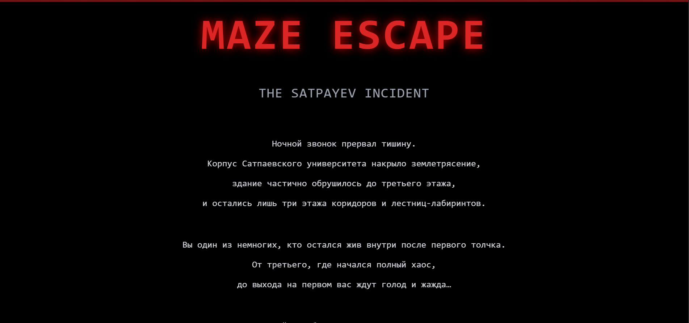
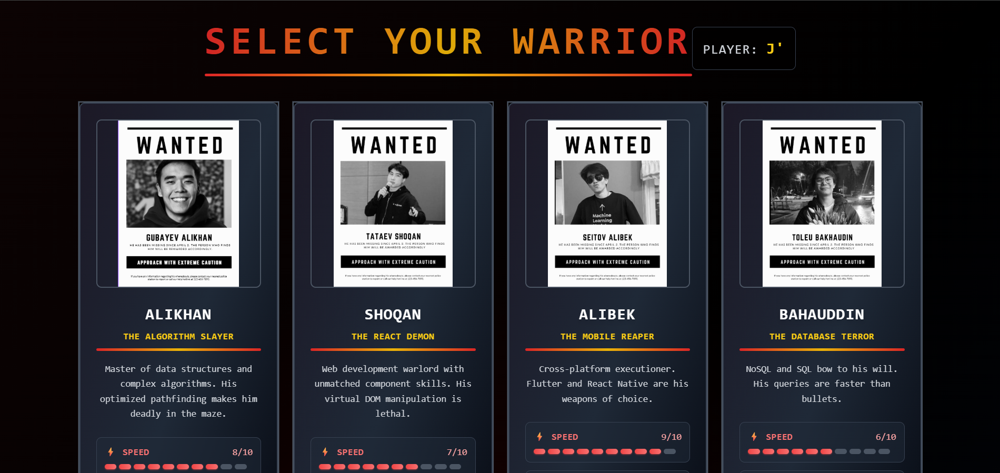
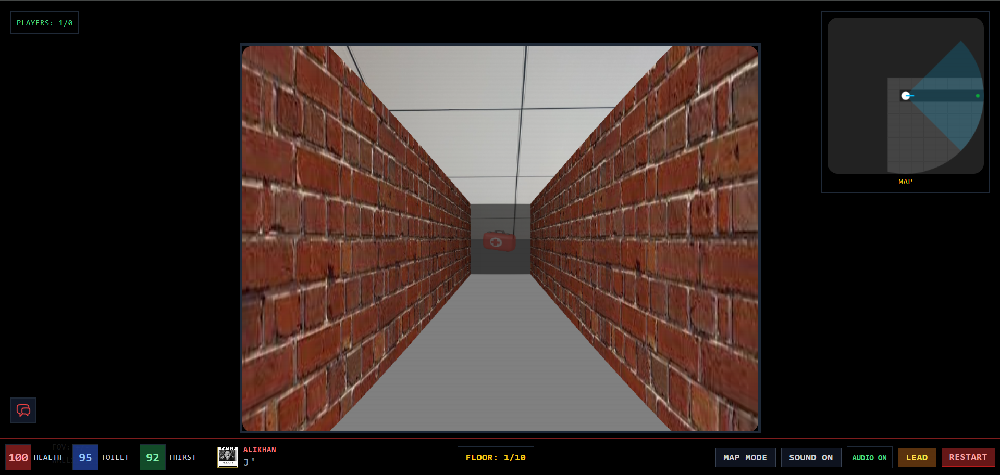

# MAZE ESCAPE: THE SATPAYEV INCIDENT



## About the Game

**Maze Escape: The Satpayev Incident** is a survival horror game where you navigate through the partially destroyed building of Satpayev University after a devastating earthquake.

### Story
During a quiet night, a phone call interrupts the silence. An earthquake has partially destroyed the building of Satpayev University, leaving only three floors of corridors and labyrinth-like staircases. You are one of the few survivors inside the building after the first tremor. From the third floor, where chaos began, to the exit on the first floor, you face hunger and thirst while trying to escape.

## Game Features

### Character Selection
Choose from four unique warriors, each with their own special abilities:



- **Alikhan (The Algorithm Slayer)** - Master of data structures and complex algorithms. Speed: 8/10
- **Shoqan (The React Demon)** - Web development warlord with unmatched component skills. Speed: 7/10  
- **Alibek (The Mobile Reaper)** - Cross-platform executioner. Flutter and React Native are his weapons. Speed: 9/10
- **Bahauddin (The Database Terror)** - NoSQL and SQL bow to his will. Speed: 6/10

### Gameplay
Experience intense first-person survival gameplay with:



- **Real-time Health Management** - Monitor your health, toilet, and thirst levels
- **Dynamic Mini-map** - Navigate through the maze with real-time positioning
- **Multiple Floors** - Progress through 10 challenging floors
- **Interactive Elements** - Find items like first-aid kits to survive
- **Multiplayer Support** - Play with friends in cooperative mode

## Getting Started

First, run the development server:

```bash
npm run dev
# or
yarn dev
# or
pnpm dev
# or
bun dev
```

Open [http://localhost:3000](http://localhost:3000) with your browser to see the result.

You can start editing the page by modifying `app/page.tsx`. The page auto-updates as you edit the file.

This project uses [`next/font`](https://nextjs.org/docs/app/building-your-application/optimizing/fonts) to automatically optimize and load [Geist](https://vercel.com/font), a new font family for Vercel.

## Learn More

To learn more about Next.js, take a look at the following resources:

- [Next.js Documentation](https://nextjs.org/docs) - learn about Next.js features and API.
- [Learn Next.js](https://nextjs.org/learn) - an interactive Next.js tutorial.

You can check out [the Next.js GitHub repository](https://github.com/vercel/next.js) - your feedback and contributions are welcome!

## Deploy on Vercel

The easiest way to deploy your Next.js app is to use the [Vercel Platform](https://vercel.com/new?utm_medium=default-template&filter=next.js&utm_source=create-next-app&utm_campaign=create-next-app-readme) from the creators of Next.js.

Check out our [Next.js deployment documentation](https://nextjs.org/docs/app/building-your-application/deploying) for more details.

